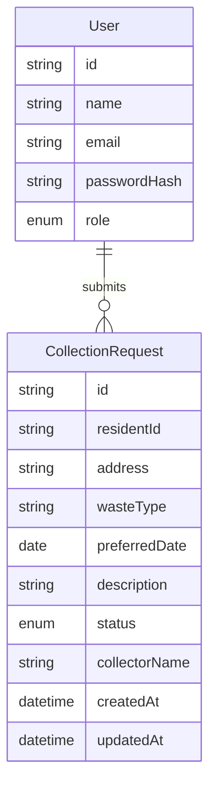
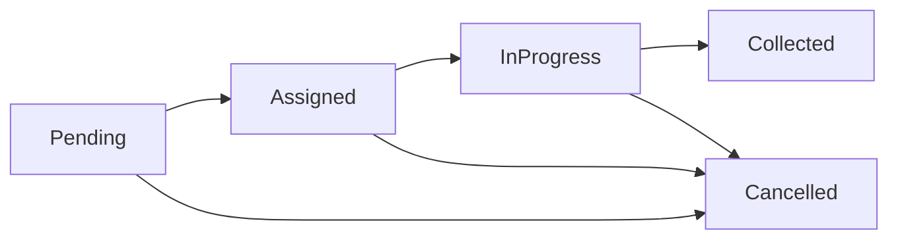

# WasteTrack Ghana — Next.js MVP Plan

## Stack (locked)

| Layer | Choice |
|---|---|
| Framework | Next.js (App Router) + TypeScript + Tailwind |
| Auth | Basic custom JWT in httpOnly cookie + bcrypt (`NFR-01`) — no Auth.js/NextAuth |
| Data | SQLite via Prisma (local MVP; switch `DATABASE_URL` to Postgres/Neon for Vercel) |
| Hosting | Vercel |
| Forms / mutations | HTML/React forms → `app/api/*` Route Handlers + Zod body checks |

NFR-06 (“models / routes / templates”) maps to: `prisma/` models, `app/` pages + `app/api/` routes, and React components.

## What “forms / mutations” means (plain English)

When a user fills a form (register, new request, assign collector), the browser needs to **send that data to the server** and change the database. That write is a **mutation**.

We will do it the basic way:

1. Form submits with `fetch` or `<form action>` to e.g. `POST /api/requests`
2. The API route reads the JSON/form body
3. **Zod** checks the fields (required address, sensible date, etc.) — if invalid, return errors (`FR-05`)
4. If valid, Prisma saves the row and returns success
5. The page refreshes or redirects so the user sees the new data

Zod is only a small validation library (like checking types/required fields before save). It is not a form UI library.

## Scope for Version 1

**Must (MVP):** FR-01–FR-09, NFR-01–NFR-04, NFR-07  
**Should (after core stable):** FR-10–FR-12  
**Could (timebox only):** FR-13 in-app notifications; FR-14 photo upload  
**Won’t:** FR-15 GPS, payments, live tracking, native app

## Data model



- **Roles:** `RESIDENT` | `ADMIN` (`FR-03`, `NFR-03`)
- **Status lifecycle:** `PENDING` → `ASSIGNED` → `IN_PROGRESS` → `COLLECTED`, plus `CANCELLED` (`FR-09`)
- **Collector:** free-text name on assign for MVP (`FR-08`) — no separate Collector entity

## App structure

```
app/
  page.tsx                 # landing
  login, register
  dashboard/               # resident
  requests/, requests/new
  admin/                   # admin only
  api/
    auth/register/route.ts
    auth/login/route.ts
    auth/logout/route.ts
    requests/route.ts
    requests/[id]/route.ts
    admin/requests/...
lib/auth.ts                # sign/verify JWT (jose), getSession
lib/prisma.ts
lib/validations.ts         # Zod schemas
prisma/schema.prisma
prisma/seed.ts
middleware.ts              # check JWT cookie; redirect; block /admin for residents
```

## Auth & access control (basic JWT)

- Register (`FR-01`): name, email, password → bcrypt hash → role `RESIDENT`
- Login (`FR-02`): verify password → sign JWT (`id`, `email`, `role`) with `jose` → set **httpOnly** cookie
- Logout: clear cookie
- Seed one **admin** and one **resident** with documented test passwords
- `middleware.ts`: no cookie → redirect protected routes to `/login` (`NFR-02`)
- Resident hitting `/admin` → redirect/403 (`NFR-03`)
- API routes re-check JWT + role server-side (never trust the UI alone)
- Residents only read/write their own requests (`FR-06`)

JWT is fine for this exam MVP: short-lived or session-length token in a secure cookie, `JWT_SECRET` in Vercel env.

## Resident flows

1. Submit request: address, waste type, preferred date, description (`FR-04`) via `POST /api/requests`
2. Zod validation before save (`FR-05`)
3. List own requests + status (`FR-06`)
4. Dashboard summary counts / recent history (`FR-10`)

## Admin flows

1. View all requests (`FR-07`)
2. Filter/search by status (`FR-11`)
3. Assign collector to `PENDING` → `ASSIGNED` (`FR-08`)
4. Progress status or cancel (`FR-09`)
5. Aggregate counts by status (`FR-12`)



## UI

- Mobile-usable responsive Tailwind (`NFR-04`)
- Landing with Login / Register
- Status badges; admin table with status filter

## Deployment & examiner access (Vercel)

- Link/deploy with Vercel CLI or Git integration
- Env on Vercel: `DATABASE_URL`, `JWT_SECRET`
- Prisma migrate + `seed` for test accounts
- Document public URL + credentials (admin + resident) (`NFR-07`)
- Acknowledge deps in README (`NFR-08`)

## Implementation order (48h-friendly)

1. Scaffold Next.js + Prisma + Neon + Vercel  
2. JWT register/login/logout + middleware + seed users  
3. Resident request API + pages + Zod validation  
4. Admin list, assign collector, status updates  
5. Should-haves: dashboards, filter, stats  
6. Deploy on Vercel + verify credentials  
7. Optional Could: in-app notifications / photo upload

## Implementation todos

1. Scaffold Next.js + Tailwind + Prisma + Neon + Vercel project wiring
2. Basic JWT auth (register/login/logout), bcrypt, middleware role gates, seed users
3. Resident submit/list/track via API routes + Zod validation (FR-04–06)
4. Admin all-requests view, assign collector, status lifecycle (FR-07–09)
5. Resident dashboard summary, admin filter/search, status stats (FR-10–12)
6. Deploy to Vercel, seed prod DB, document URL + test credentials + library acknowledgements

## Out of scope for this plan

Could-haves only if Must+Should are deployed and stable. No GPS, payments, or collector mobile app. No Auth.js. No Netlify.
