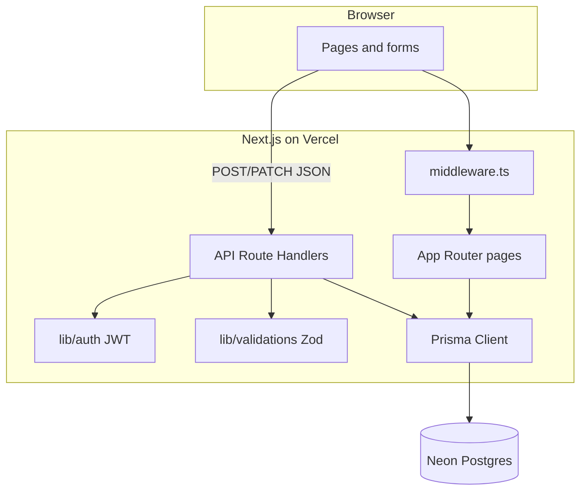
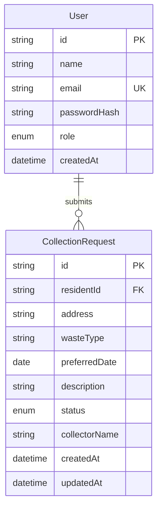
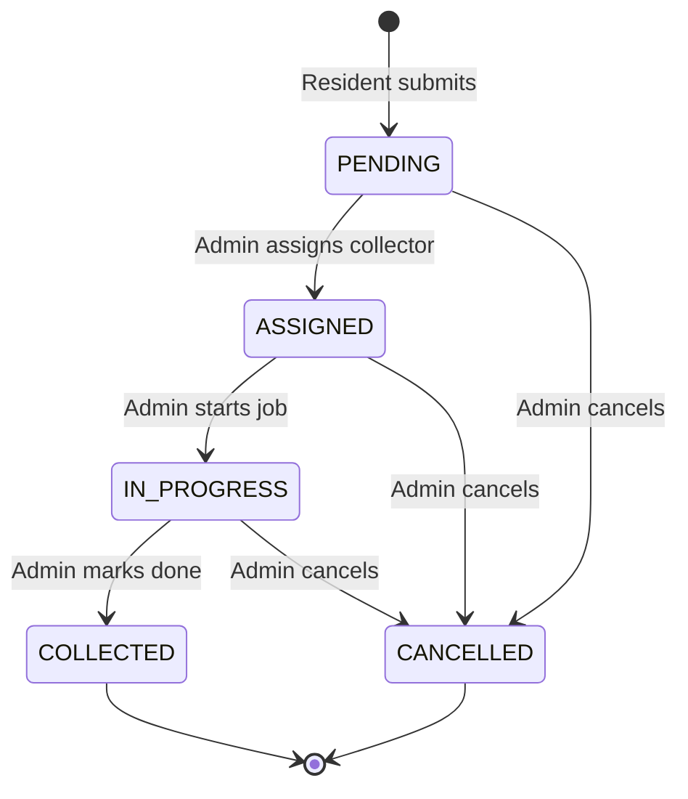
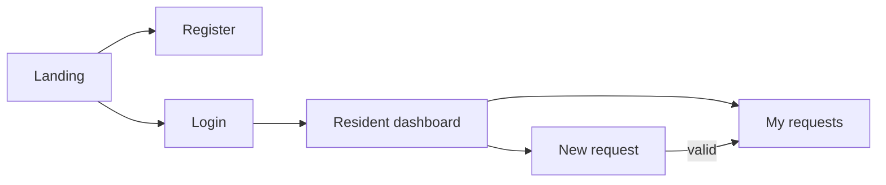
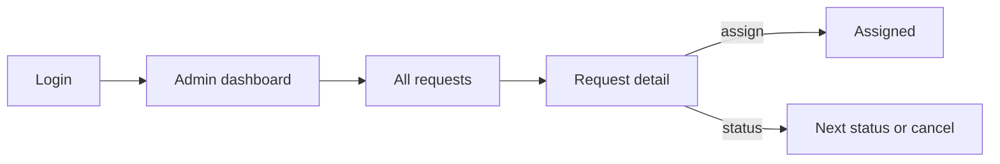

# WasteTrack Ghana — Software Design

**System:** WasteTrack Ghana  
**Purpose:** Digitise household waste-collection request and tracking for Ghanaian residential communities.  
**Stack:** Next.js (App Router), TypeScript, Tailwind CSS, Prisma, Neon Postgres, JWT auth, Vercel.  
**Scope:** Version 1 MVP — Must (FR-01–FR-09) and Should (FR-10–FR-12). Could-haves (FR-13, FR-14) are designed lightly but not required for delivery.

This document translates the requirements (Chapter 1) into architecture, data, security, UI, and API design for implementation and testing.

---

## 1. Design goals

| Goal | How design supports it |
|---|---|
| Digitise request-and-track | Resident submits and views status online; admin assigns and progresses jobs |
| Role separation | Distinct routes, JWT `role` claim, server-side checks |
| Maintainable in 48h | Clear layers: pages (UI), `app/api` (routes), Prisma (models), `lib` (auth/validation) |
| Examiner-reachable | Public Vercel URL + seeded test accounts |
| Secure enough for MVP | Salted password hashes, httpOnly JWT cookie, protected routes |

---

## 2. High-level architecture

The application is a **server-rendered Next.js web app** with JSON API routes for mutations. The browser never talks to the database directly.

### Layer mapping (NFR-06)

| Classic MVC idea | This project |
|---|---|
| Models | `prisma/schema.prisma` + Prisma Client |
| Routes / controllers | `app/api/**/route.ts` |
| Templates / views | `app/**/page.tsx` + shared components |

---

## 3. Component / module design

| Module | Responsibility |
|---|---|
| `app/(public)` | Landing, login, register |
| `app/dashboard` | Resident summary (FR-10) |
| `app/requests` | Resident list + new request (FR-04, FR-06) |
| `app/admin` | Admin dashboard, all requests, assign/update (FR-07–FR-12) |
| `app/api/auth/*` | Register, login, logout |
| `app/api/requests/*` | Create/list/update collection requests |
| `lib/auth.ts` | Hash/compare passwords; sign/verify JWT; read session from cookie |
| `lib/validations.ts` | Zod schemas for auth and request payloads |
| `lib/prisma.ts` | Single Prisma client instance |
| `middleware.ts` | Gate protected paths; block residents from `/admin` |
| `prisma/seed.ts` | Examiner admin + resident accounts |

---

## 4. Data design

### 4.1 Entity-relationship

### 4.2 Enumerations

**User.role**

| Value | Meaning |
|---|---|
| `RESIDENT` | Default on registration; own requests only |
| `ADMIN` | Seeded only in v1; all requests + assign/status |

**CollectionRequest.status**

| Value | Meaning |
|---|---|
| `PENDING` | Submitted; awaiting assignment |
| `ASSIGNED` | Collector name set |
| `IN_PROGRESS` | Collection underway |
| `COLLECTED` | Completed |
| `CANCELLED` | Stopped by admin |

### 4.3 Status lifecycle (FR-09)

**Rules**

- New requests always start as `PENDING` with `collectorName = null`.
- Assigning a collector requires a non-empty collector name and moves `PENDING` → `ASSIGNED`.
- Status updates must follow allowed transitions (reject illegal jumps server-side).
- Residents cannot change status or assign collectors.

### 4.4 Field notes

| Field | Notes |
|---|---|
| `email` | Unique; used as login identifier |
| `passwordHash` | bcrypt only — never store plain text (`NFR-01`) |
| `address` | Free-text (FR-15 GPS out of scope) |
| `wasteType` | Controlled set e.g. General, Recyclable, Organic, Hazardous |
| `preferredDate` | Date ≥ today at submit time (`FR-05`) |
| `collectorName` | Free-text for MVP (no Collector table) |

---

## 5. Security design

### 5.1 Authentication (FR-01, FR-02, NFR-01)

1. **Register:** validate input → bcrypt hash password → create `User` with `role = RESIDENT`.
2. **Login:** find by email → `bcrypt.compare` → sign JWT payload `{ sub: userId, email, role }` with `JWT_SECRET` → set **httpOnly**, `Secure` (production), `SameSite=Lax` cookie (e.g. `wastetrack_token`).
3. **Logout:** clear cookie.
4. Token lifetime: e.g. 7 days (exam usability); secret only in Vercel env.

### 5.2 Authorisation (FR-03, NFR-02, NFR-03)

| Check | Where |
|---|---|
| Must be logged in | `middleware.ts` for `/dashboard`, `/requests`, `/admin`, and matching APIs |
| Admin-only UI/API | Middleware blocks `RESIDENT` from `/admin`; API returns 403 if `role !== ADMIN` |
| Own-data only | Resident queries/filters `residentId === session.userId` |

UI hiding alone is **not** sufficient — every mutating admin route re-checks role on the server.

### 5.3 Input validation (FR-05)

Zod schemas reject empty address, missing waste type/date/description, and past preferred dates before Prisma writes.

---

## 6. UI / screen design

Responsive layouts for desktop and mobile (`NFR-04`). Shared chrome: brand “WasteTrack Ghana”, nav by role, logout.

### 6.1 Screen inventory

| Screen | Audience | Requirements |
|---|---|---|
| Landing | Public | Entry to login/register |
| Register | Public | FR-01 |
| Login | Public | FR-02 |
| Resident dashboard | Resident | FR-10 — counts + recent requests |
| My requests | Resident | FR-06 — list + status badges |
| New request | Resident | FR-04, FR-05 |
| Admin dashboard | Admin | FR-12 stats + FR-11 filter entry |
| Admin requests | Admin | FR-07, FR-11 list/filter |
| Admin request detail / actions | Admin | FR-08 assign, FR-09 status |

### 6.2 Resident flow

### 6.3 Admin flow

### 6.4 Status presentation

Use clear badges (colour + label): Pending, Assigned, In Progress, Collected, Cancelled — same labels on resident and admin views for consistency.

### 6.5 Could-have UI (not MVP-blocking)

- **FR-13:** In-app notification list or banner when status changes (store `Notification` rows or derive from `updatedAt`).
- **FR-14:** Optional photo field on create (object storage later); omit from MVP schema if time-pressed.

---

## 7. API design

All mutating endpoints require a valid JWT cookie unless noted. JSON request/response.

### 7.1 Auth

| Method | Path | Auth | Behaviour |
|---|---|---|---|
| `POST` | `/api/auth/register` | Public | Create resident; optional auto-login |
| `POST` | `/api/auth/login` | Public | Set JWT cookie |
| `POST` | `/api/auth/logout` | Authenticated | Clear cookie |

### 7.2 Requests (resident)

| Method | Path | Auth | Behaviour |
|---|---|---|---|
| `GET` | `/api/requests` | Resident | Own requests only |
| `POST` | `/api/requests` | Resident | Create `PENDING` request |

**POST body (conceptual):** `{ address, wasteType, preferredDate, description }`

### 7.3 Admin

| Method | Path | Auth | Behaviour |
|---|---|---|---|
| `GET` | `/api/admin/requests` | Admin | All requests; optional `?status=` filter (FR-11) |
| `PATCH` | `/api/admin/requests/[id]` | Admin | Assign collector and/or update status (FR-08, FR-09) |
| `GET` | `/api/admin/stats` | Admin | Counts by status (FR-12) |

**PATCH body (conceptual):** `{ collectorName?: string, status?: Status }`

Server enforces transition rules and that assignment sets status to `ASSIGNED`.

---

## 8. Deployment design (NFR-07, NFR-08)

| Item | Design choice |
|---|---|
| Host | Vercel |
| Database | Neon Postgres (`DATABASE_URL` pooled + `DIRECT_URL` for migrations) |
| Secrets | `JWT_SECRET`, `DATABASE_URL`, `DIRECT_URL` in Vercel env — never committed |
| Seed | Admin + resident test users documented for examiner |
| Docs | README acknowledges Next.js, Prisma, Neon, Zod, bcrypt/jose, Tailwind, Vercel |

---

## 9. Requirements traceability

| ID | Design element |
|---|---|
| FR-01 | Register page + `POST /api/auth/register` + User model |
| FR-02 | Login/logout pages + auth API + JWT cookie |
| FR-03 | `role` enum + middleware + API role checks |
| FR-04 | New request page + `POST /api/requests` |
| FR-05 | Zod schemas in `lib/validations.ts` |
| FR-06 | My requests page + resident-scoped GET |
| FR-07 | Admin requests list |
| FR-08 | Admin PATCH assign `collectorName` |
| FR-09 | Status enum + transition rules + admin PATCH |
| FR-10 | Resident dashboard aggregates |
| FR-11 | Admin `?status=` filter UI + API |
| FR-12 | Admin stats endpoint + dashboard cards |
| FR-13 | Optional notifications module (Could) |
| FR-14 | Optional photo field/storage (Could) |
| FR-15 | Explicitly out of design |
| NFR-01 | bcrypt `passwordHash` |
| NFR-02 | `middleware.ts` redirects |
| NFR-03 | Server-side admin checks |
| NFR-04 | Responsive Tailwind layouts |
| NFR-05 | Simple pages, Neon + Vercel edge/network; avoid heavy client bundles |
| NFR-06 | models / api routes / pages structure |
| NFR-07 | Vercel public URL + seed credentials |
| NFR-08 | README acknowledgements |

---

## 10. Design decisions (summary)

1. **Next.js over Flask** — examiner familiarity with modern web stack; Vercel deploy path the author already uses.
2. **JWT cookie over Auth.js** — simpler to explain in a report; full control for exam demonstration.
3. **API routes over Server Actions** — explicit REST-style mutations that map cleanly to testing and documentation.
4. **Free-text collector** — avoids extra entity within 48h; still satisfies FR-08.
5. **Should-haves included in design** — implement after Must path is stable so MoSCoW remains defensible.

---

## 11. Out of scope (Won’t — v1)

Payment processing, GPS/live tracking, route optimisation, AI collector matching, native mobile app, and FR-15 GPS address capture.
